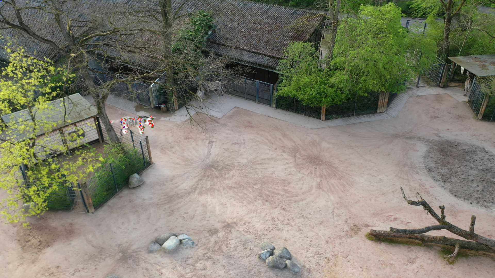

## Fitting Articulated Animal Model (SMAL) to Multiview Keypoints Using pytorch




## Table of Contents
  * [License](#license)
  * [Description](#description)
  * [Usage](#usage)
  * [Contact](#contact)


## License

Software Copyright License for **non-commercial scientific research purposes**.
Please read carefully the [terms and conditions](https://github.com/vchoutas/smplx/blob/master/LICENSE) and any accompanying documentation before you download and/or use the SMPL-X/SMPLify-X/SMAL/SMALR model, data and software, (the "Model & Software"), including 3D meshes, blend weights, blend shapes, textures, software, scripts, and animations. By downloading and/or using the Model & Software (including downloading, cloning, installing, and any other use of this github repository), you acknowledge that you have read these terms and conditions, understand them, and agree to be bound by them. If you do not agree with these terms and conditions, you must not download and/or use the Model & Software. Any infringement of the terms of this agreement will automatically terminate your rights under this [License](./LICENSE).

## Description

This repository contains fitting code for the SMAL animal model, optimized for data collected from drones. Unlike [SMALR](https://github.com/silviazuffi/smalr_online), it uses pytorch instead of chumpy, in analogy with [SMPLify-x](https://github.com/vchoutas/smplify-x). This makes optimization significantly more efficient than SMALR. The code mostly follows the structure of SMPLify-x. In this pipeline, however, it is assumed that camera extrinsics and intrinsics are known, and that animals are located close to the ground plane. Animal pose is then estimated in the coodinate frame of the cameras. Cameras are expected to look towards the ground, as is usually the case with drone footage. The code is designed to support both single- and multiview pose estimation, a demo for multiview will be provided soon. This repository is a part of the project "Animal Pose Estimation with UAVs" described in [this video](https://www.youtube.com/watch?v=EiarAs1s7wg&ab_channel=AamirAhmad).

## Usage

### Dependencies and Setup

 - Clone this repository with its submodules
 - Install the following dependencies:
    1. [PyTorch](https://pytorch.org/)
    2. [SMPL-X](https://github.com/vchoutas/smplx) dependencies
    3. [pytorch3d](https://pytorch3d.org/)
    4. pip install -r requirements.txt
 - The original SMAL model file (.pkl) contains data structures defined in chumpy library. We provide a patch to eliminate this dependency: 
```Shell
cd smalify
python model_patch.py
cd ..
```

### Fitting 

To run a demo, use the following command:
```Shell
python smalify/main.py \
  --config cfg_files/fit_smal.yaml \
  --data_folder demo_data \
  --visualize True \
  --model_folder smalify/SMAL.pkl
```
The results should appear in the output folder. Meshes can be visualised, for example, in Blender.


### Using your own data
To run optimization on your own data, create the data structure as follows: 
 - `cam_name.json` with keypoints observed from the camera
 - `cam_name_pose.json` with camera pose
 - `images/` folder with corresponding images or a video, see details below
 
 In the json files, each frame is associated with a unique id number. In case of a video input, these ids correspond to frame numbers. In case of image inputs, they correspond to image names. For each keypoint, 3 values are provided: the keypoint's 2D coordinates in the image plane and its presence. Presence takes values 0 or 1 and indicates whether the keypoint should be used for fitting. The list of keypoints and their order is provided in [this file](./smalify/landmark_names.txt).

Example data is provided in the `demo_data` directory.

### Additional Features

 - Optionally, instead of the `images/` folder a video can be provided, e.g. `cam_name.mp4`. If using this option, please change the `dataset` field to `video_animal` from `image_animal` in the configuration file.
 - If the animal is not expected to lean forwards, backwards or to the sides, the `yaw_only` parameter can be set to `True` in the configuration file. This effectively acts as a prior on the animal pose, allowing it to rotate in the "yaw" but not in the "pitch" or "roll" directions.


### Optional Dependencies

1. [PyTorch Mesh self-intersection](https://github.com/vchoutas/torch-mesh-isect) for interpenetration penalty 
   * Download the per-triangle part segmentation: [smplx_parts_segm.pkl](https://owncloud.tuebingen.mpg.de/index.php/s/MWnr8Kso4K8T8at)
2. [Trimesh](https://trimsh.org/) for loading triangular meshes
3. [Pyrender](https://pyrender.readthedocs.io/) for visualization

## Contact
This project was built upon [SMALR](https://github.com/silviazuffi/smalr_online) and [SMPLify-X](https://github.com/vchoutas/smplify-x) by [Egor Iuganov](mailto:egor.iuganov@ifr.uni-stuttgart.de) from the [Flight Robotics and Perception Group](https://www.aamirahmad.de/).

For commercial licensing (and all related questions for business applications), please contact [ps-licensing@tue.mpg.de](mailto:ps-licensing@tue.mpg.de).
